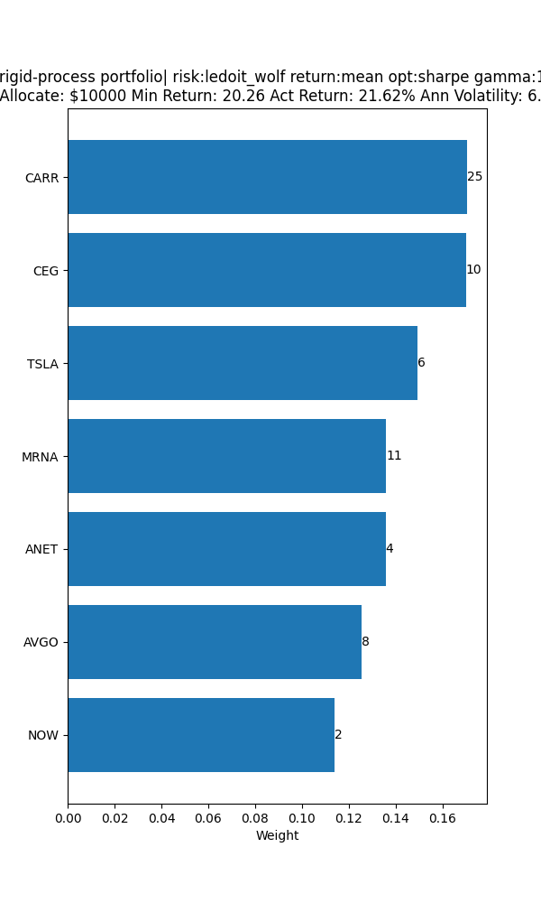
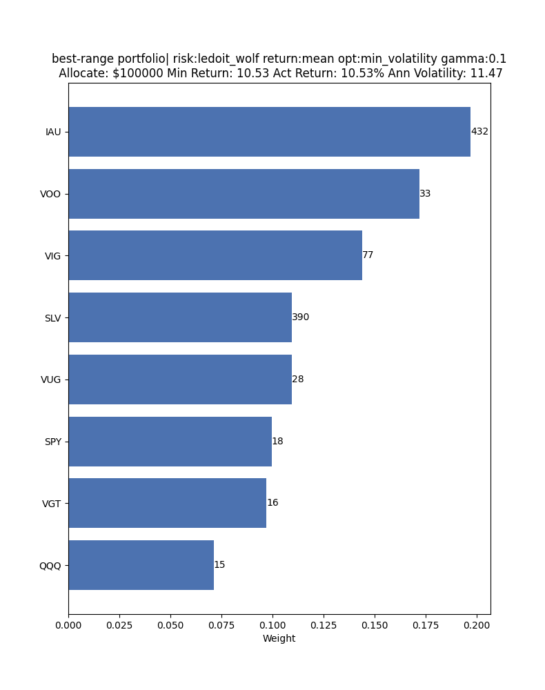

### What Is This?
`trademan` is a utility to gather market data and generate optimal portfolios via a CLI interface. Data is provided by  and portfolio optimization is done with . Stock data is cached to a diskcache for a week to prevent excess YFinance calls.

### How To Install It:
`pip install git+https://github.com/SoundsSerious/trademan.git@v0.1.0`

### How Do I Use It:
The current interface is provided by cli and matplotlib plots

##### Download Market Data:
`market_dl` will download snp500 and etfs and save data to a diskcache location customizable via env var: `TRADEMAN_DATA_DIR`

##### Trademan Portfolio Optimizer:
`trademan` CLI has the following CLI arguments

```bash
usage: Portfolio Generator [-h] [-risk {covariance,ledoit_wolf}] [-retrn {mean}]
                           [-opt {sharpe,min_volatility,eff_return,eff_risk}] [-cls {etfs,stocks,all}] [-alloc ALLOC]
                           [-name NAME] [-filename FILENAME] [-rfr RFR] [-gamma GAMMA] [-cycl-err CYCL_ERR]
                           [-std-err STD_ERR] [-min-wght MIN_WGHT] [-max-wght MAX_WGHT] [-in INCLUDE] [-ex EXCLUDE]

optional arguments:
  -h, --help            show this help message and exit
  -risk {covariance,ledoit_wolf}
                        select the risk model, standard covariance or the extremity filtering `ledoit wolf` model
  -retrn {mean}         return model - mean historical performance averages
  -opt {sharpe,min_volatility,eff_return,eff_risk}
                        optimization model: maximum risk to return model via sharpe, min_volatility only considers
                        risk, and efficient models will try to achieve 90 percent of the best performing asset
  -cls {etfs,stocks,all}
                        choose which type of items to trade
  -alloc ALLOC          choose the amount of money to allocate, this will label the output chart with the number of
                        shares to purchase
  -name NAME            add a name to the portfolio, if none provided a randomly generated name will be created
  -filename FILENAME    where to store the file, by default it will be stored in a dir set by `TRADEMAN_MEDIA_DIR`
  -rfr RFR              the risk free rate, adjusted per daily returns
  -gamma GAMMA          the weight regularizer, large values penalize small weight values, make 0 to not penalize
                        small weights
  -cycl-err CYCL_ERR    default: 0| penalize new assets returns by a factor of economic cycle: `cycle-err x standard
                        error x (10/Nyears)^2`
  -std-err STD_ERR      default: 0| penalize returns by subtracting the `std-err x std-dev`
  -min-wght MIN_WGHT    assets less than this percent are filtered from the final portfolio
  -max-wght MAX_WGHT    assets are limited to this max percentage
  -in INCLUDE, --include INCLUDE
                        csv of a strict include on the ticker name
  -ex EXCLUDE, --exclude EXCLUDE
                        csv of a strict exclude on the ticker name
```

##### Examples
1. Make A Portfolio Of Best Performing SNP500 Stocks Penalizing Short Lived Assets By 10X With A Max Asset Allocation of 20%, And Determine Number of assets shares to buy with an allocation of $10000.
```bash
trademan -cls stocks -gamma 1 -alloc 10000  -cycl-err 10 -max-wght 0.2
```



2. Make A Portfolio Of Least Volatile ETFS: `QQQ,SCHG,VGT,SLV,VIG,SPY,VOO,VUG,IAU,PAVE` and determine the number of stock purchases for a $100000 allocation.
```bash
trademan -cls etfs -gamma 0.1 -alloc 100000 -in QQQ,SCHG,VGT,SLV,VIG,SPY,VOO,VUG,IAU,PAVE -opt min_volatility
```

